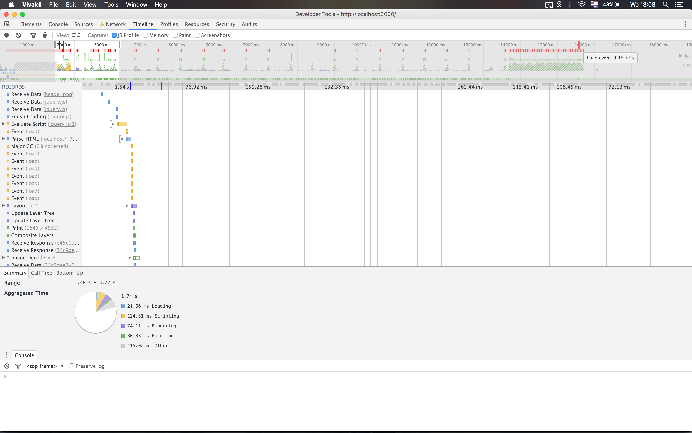
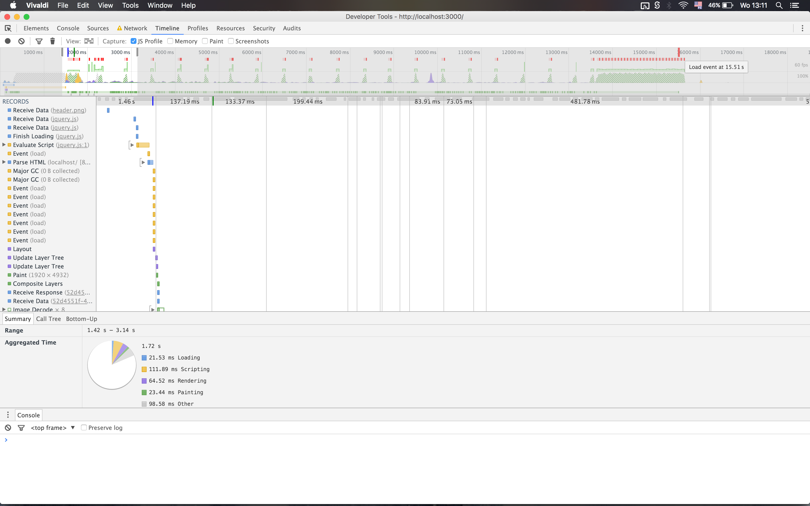
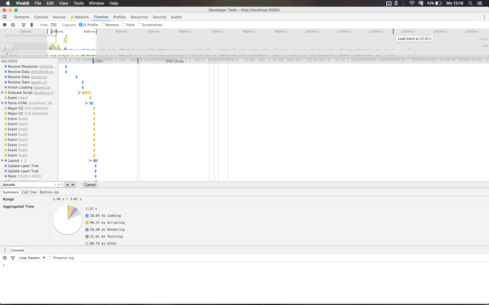
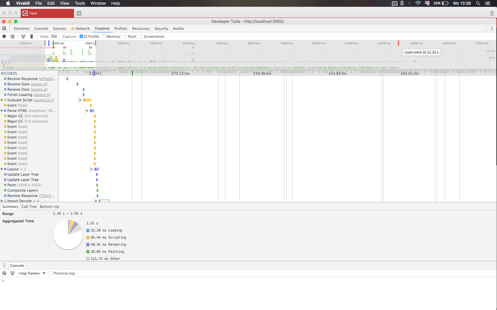
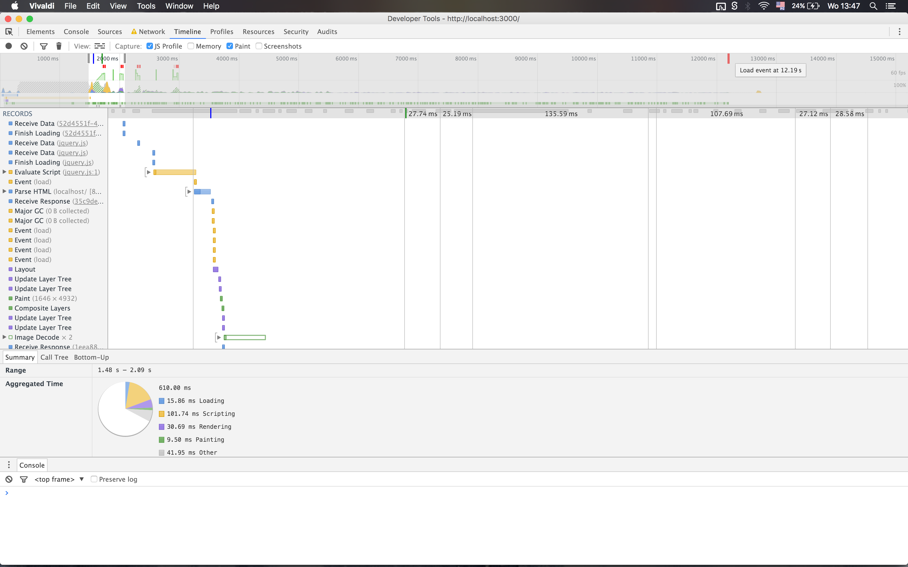
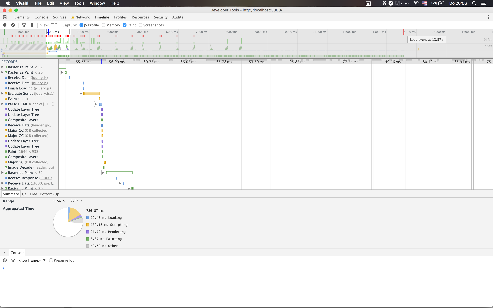
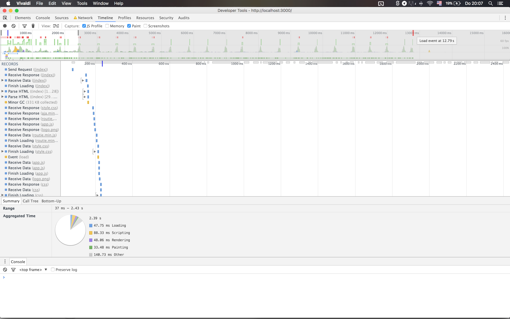
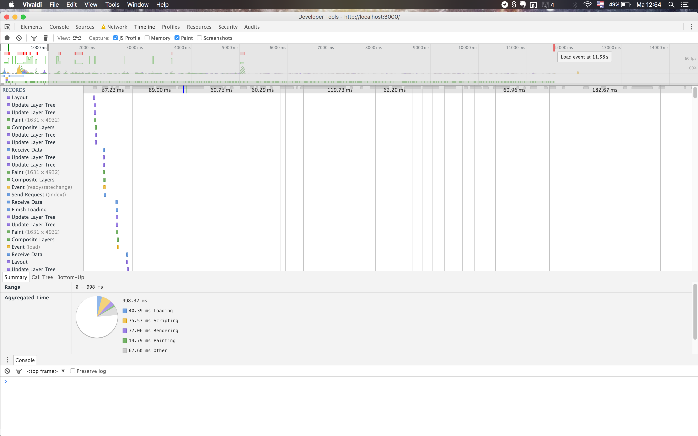
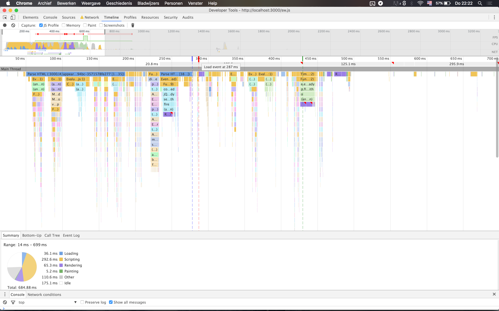

# LookLive server

The project you're looking at is an [express.js](http://expressjs.com) project. You'll use it to get set up a development environment where you're
going to optimize the way this project works. In it's current state, the css is messy, the rendering isn't modern and
overall the product is boring and not efficient. It's up to you to fix this and improve it.

## Getting started

### Step 1 - clone the repo
Github provides some instructions for this and we're assuming that you know how to clone this repo. If you're not sure,
don't hesitate to raise your hand now and ask.

### Step 2 - install dependencies
In order to run the server you'll need to install express.js and it's dependencies. In order to do this, open up a 
terminal and navigate to your project folder (for example `cd ~/Projects/looklive-server`). When you've done this, type
this command to run the instal:

```
npm install
```

That should get you setup.

### Step 3 - running the server
To run the server, stay at the 'root' of your project folder and type:

```
npm start
```

That will get the server to run on port 3000. If you go to [http://localhost:3000](http://localhost:3000) in your browser
you should see an overview page.

## The api

This project comes with a simple API. All you need to know for now is that there's three endpoints:

* `/api/feed/` <- returns a feed of appearances
* `/api/appearance/:uuid` <- returns a single appearance, more detailed than in the feed. Replace `:uuid` with the 
appearance id.
* `/api/product/:uuid` <- returns a single product, including similar and bargain products. Replace `:uuid` with the 
product id.

The API returns JSON (for now).


#1: Performance Tweaks
##Initial state


##Semantic HTML & Deleted excessive HTML
The difference was bigger than I thought it would be. Apparently using HTML can have a considerable effect on your website's performance.
###Before

###After


##Optimized header image and changed from PNG to JPG
This was a huge performance boost for the website. The loading time dropped more than 3(!) seconds. This has made me realize that it's really important for webdevelopers to keep the size of their images in check.
###Before

###After


##Optimized CSS
Optimizing CSS had a smaller impact on the page's load time than I previously thought it would have. Still it reduced the loading time by almost 100ms.
###Before

###After


##Changed PNG icons to SVG Spritesheet
Changing the PNG icons to an SVG spritesheet barely had any impact on the site's loading time.
###Before

###After


##Deleted jQuery
Deleting jQuery had significant influence on the page's load time. This dropped by 780ms. Although I have to say that I expected the drop to be a lot bigger, since there is a lot of discussion about how much impact jQuery can have on a website's performance.
###Before

###After


##Optimized header image again
Since the header image was still too big, I decided to optimize it some more. I managed to drop the file size from 800kb to around 150 kb. The result was quite significant, reducing the load time by 1.2 seconds.
###Before

###After


##Implemented Service Worker
By implementing a service worker you can make your application work offline by saving its content as cache. This was a huge boost for the load time of the website, which was reduced drastically.
###Before

###After


##Conclusion
After implementing some tweaks to reduce the load time, I came to the realization that a lot of responsibility belongs to us as developers. It's our job to make sure images are small and the correct type. We have to decide whether or not to implement jQuery, and we have total control over how we write our HTML and CSS. The decisions we make during the development of a website will have a big impact on the way a user sees a website, and the company it belongs to.

#2: Progressive Web App
##What are progessive web apps

Progressive web applications are websites that use some of the latest web technologies, and create an experience as close to a native application as possible. They are websites that start out in a tab in your browser, but as you use the application more it will give you a popup, offering to be added to your homescreen. While it may sound as no more than a basic bookmark, in reality it is a lot more than that. The power of PWAs lies in the fact that, over time, you will start building a relationship with them. They will start acting as a native app and offer functionalities previously only available to those apps. To give examples, a PWA has the ability to send push notifications and work offline. As well as offering a fullscreen experience. All this without having to download it from an app store.

###Characteristics
According to Google, progressive web apps are:
- **Progressive** - They work for every user, regardless of the browser.
- **Responsive** - They fit on every screen.
- **Connectivity independent** - Enhanced with service workers to work offline and with low quality network connections.
- **App-like** - Feel like a native application.
- **Fresh**	- They are always up-to-date, thanks to the service worker.
- **Safe** - Served via HTTPS.
- **Discoverable** - Are identifiable as "applications", allowing search engines to find them.
- **Re-engageable** - Make re-engagement easy through features like push notifications.
- **Installable** - Allow users to keep apps on the home screen, without needing an app store.
- **Linkable** - Easily shareable via URL.

According to TJ van Toll, at a high level, for a web app to be progessive, it must do three things:
- Register a service worker, giving the application the ability to work offline and send push notifications etc.
- Run on HTTPS, it has to be served in a safe environment, protecting the user from nasty, harming scripts being injected.
- Create an *app manifest file*, in which you specify information about your app, its name would be a good start.

For speed and functionality PWAs rely on the Application Shell Architecture and Service Workers. Think of it like this: service workers have the basic interface and design of the web application ready to be served at all times. This makes for the shell of the application. In Application Shell Architecture service workers first serve the shell, and then content is delivered through API requests. Note that these will often be cached by a service worker. This allows the application to show the user the content he last saw when visiting the site, while waiting on new content to be loaded. Which, according to Google, allows for a much quicker loading of websites, especially on mobile connections.

###Advantages
- Push notifications.
- App-like experience at a much lower cost.
- Fast loading times.
- It's hosted on the web, saving the user precious storage space.

###Disadvantages
- Not available in app stores, so users will not be able to find your application there.
- Not currently available on iOS. Android only.


##Sources
- http://www.emerce.nl/achtergrond/progressive-web-apps-de-toekomst-van-mobiele-apps
- http://stackoverflow.com/tags/progressive-web-apps/info
- http://developer.telerik.com/featured/what-progressive-web-apps-mean-for-the-web/
- http://arc.applause.com/2015/11/30/application-shell-architecture/
- https://developers.google.com/web/fundamentals/getting-started/your-first-progressive-web-app/

#3: Looklive Online
The looklive application is online and can be seen at https://performance.mreijnoudt.com


